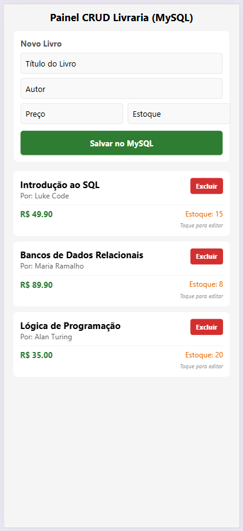
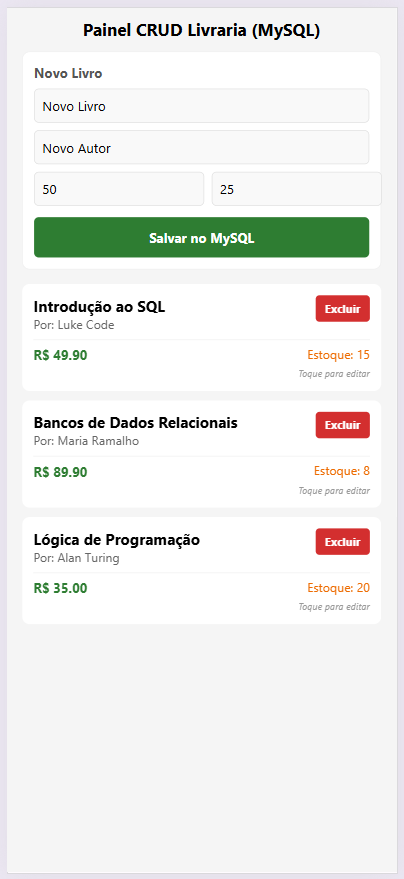
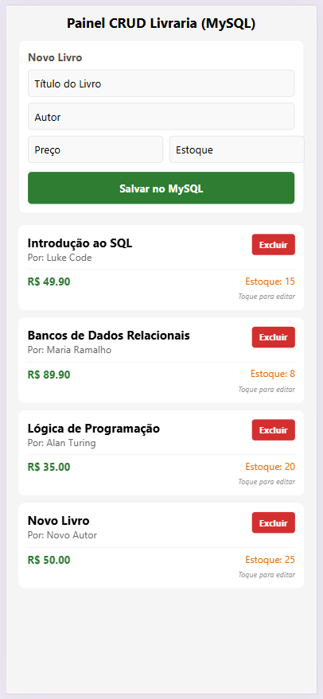
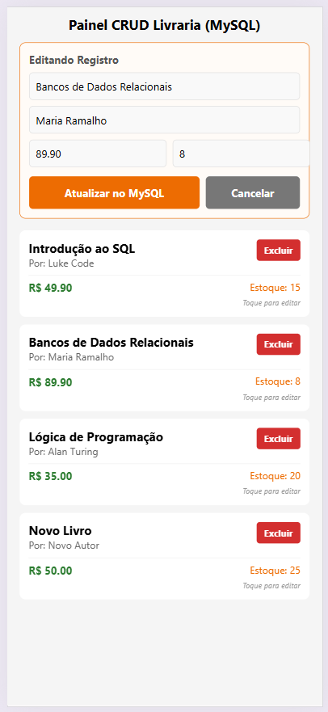
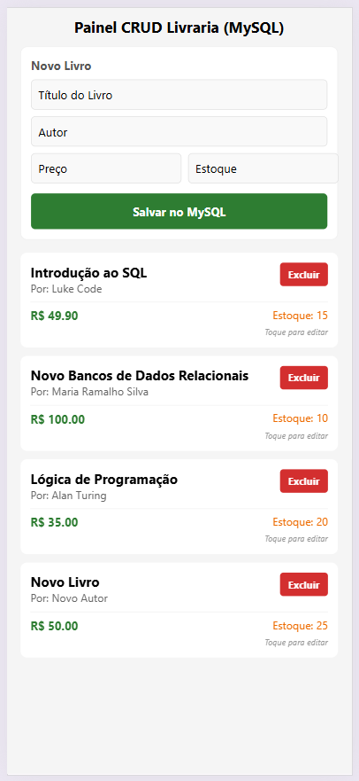

# 03-node-mysql-react-native

# Interação

Dando continuidade à prática anterior: 
https://github.com/wdiasmaciel/02-node-mysql-react-native

Para que o seu app em React Native converse com o MySQL no Codespaces, você precisará de uma API (um back-end) no meio do caminho e precisará liberar uma porta pública no GitHub Codespaces.

---

# Funcionamento  
```text
[ App React Native ]  
        │  (Requisição HTTP / JSON)
        ▼
[ API Back-end: Node.js ] 
        │  (Conexão SQL Nativa)
        ▼
[ Banco de Dados MySQL ] 
```
---

# O que você precisa fazer para dar certo no Codespaces

Para que o aplicativo de celular (ou o emulador) consiga enxergar o seu back-end que está rodando dentro do Codespaces, siga estes passos:

## 1. Criar uma API simples no Codespaces

Você pode criar um servidor simples em `Node.js` (`Express`), dentro do mesmo repositório do Codespaces. 

Esse código vai se conectar ao `MySQL` localmente (usando `localhost` e a senha `root`) e vai expor rotas como `/clientes` ou `/livros`.

## 2. Tornar a porta da API PÚBLICA no GitHub

Por padrão, o Codespaces bloqueia qualquer acesso externo por segurança. 

Se a sua API estiver rodando na porta `3000`, por exemplo, você precisa liberá-la:

1. No VS Code do navegador, vá na aba `Ports` (Portas), que fica ao lado do Terminal.

2. Procure a linha da porta da sua API (ex: 3000).

3. Clique com o botão direito sobre ela, vá em `Port Visibility` (Visibilidade da Porta) e mude de `Private` para `Public`.

O `GitHub` vai te dar uma URL longa (ex: https://github.dev).

## 3. Chamar essa URL no React Native

No código do seu aplicativo React Native, você usará o comando `fetch` ou a biblioteca `axios` apontando para a URL gerada pelo `GitHub`:

```javascript
// Exemplo no React Native:
fetch('https://github.dev')
  .then(response => response.json())
  .then(data => console.log(data));
```
---

# Atualizar a Lista de Pacotes no Linux

Execute o comando abaixo para identificar atualizações de programas:
   ```bash
   sudo apt update
   ```

O comando `sudo apt update` atualiza a lista de pacotes disponíveis e suas versões nos repositórios configurados no seu sistema Linux.

## Significado de Cada Parte do Comando

`sudo`: executa o comando com permissões de administrador (`root`).

`apt`: é o gerenciador de pacotes usado em distribuições como Ubuntu, Debian e Mint. `APT` significa Advanced Package Tool (Ferramenta de Pacotes Avançada). Ele é o sistema que gerencia todos os programas do computador:
   1. Instala novos programas.
   2. Atualiza os softwares existentes.
   3. Remove aplicativos que você não quer mais.
   4. Resolve dependências, que significa instalar automaticamente outros arquivos e bibliotecas que um programa precisa para funcionar.
Antes do APT, os usuários precisavam baixar e compilar cada programa manualmente, o que era muito complexo. O APT automatizou todo esse processo.

`update`: conecta-se aos servidores oficiais para baixar as informações mais recentes sobre os programas disponíveis: 
   - Não atualiza o sistema: este comando não instala atualizações nos programas que já estão no seu computador.
   - Apenas verifica: ele apenas avisa o seu computador quais novas versões de programas existem.
   
## OBS: Instalar Todas as Atualizações

Execute o comando abaixo para instalar as atualizações que foram encontradas:
   ```bash
   sudo apt upgrade
   ```
**Importante**: para instalar o Node.js, basta eu executar `sudo apt update` e `sudo apt install -y nodejs`.

1. O `update` é obrigatório, porque ele atualiza a lista do sistema. Isso garante que o seu computador encontre o Node.js nos servidores e baixe a versão correta.

2. O `upgrade` serve apenas para atualizar os programas que já estão instalados no seu computador. Rodar esse comando apenas faria você perder tempo esperando todo o seu sistema ser atualizado antes de colocar o Node.js.

---

# Instalar o Node.js

Instale o Node.js com o comando abaixo:
   ```bash
   sudo apt install -y nodejs
   ```

---

# Versão do Node.js
Execute o comando abaixo para verificar a versão do Node.js instalado:
   ```bash
   node -v 
   ```
---

# Node Package Manager (NPM):

Verifique a versão do Node Package Manager (NPM) instalado:
   ```bash
   npm -v
   ```

Caso o Node Package Manager (NPM) não esteja instaldo, execute o comando abaixo:
   ```bash
   npm install -g npm@latest
   ```

---

# Criar um Projeto Usando o Expo 

1. https://expo.dev/ 

2. https://docs.expo.dev/ 

  ```bash
  npm install expo
  ```

  ```bash
  npx create-expo-app@latest --template
  ```

Caso seja apresentada a mensagem abaixo, informe `y`:
   ```text
   Need to install the following packages:
   create-expo-app@4.0.0
   Ok to proceed? (y) 
   ```

Com as setas do teclado, escolha o template `Blank (TypeScript)`.

Informe um nome para o aplicativo. Exemplo: `meu-app`.

Selecione a opção: `Latest (SDK 57) - Recommended for most projects`.

   ```text
   ? Select an Expo SDK version: › - Use arrow-keys. Return to submit.
   ❯   Latest (SDK 57) - Recommended for most projects
       For learning with Expo Go (SDK 54)
       Other SDK version…
   ```

Caso seja apresenta a mensagem abaixo, pressione `Y`.
   ```text
   ? You are creating a project inside of an existing Git repository. Skip initializing a new git repository? › (Y/n)
   ```

Entre no diretório do aplicativo:
   ```bash
   cd meu-app
   ```

Execute o comando:
   ```bash
   npx expo install react-dom react-native-web react-native-safe-area-context
   ```

Caso seja apresenta a mensagem abaixo, pressione `Y`.
   ```text
   Need to install the following packages:
   expo@57.0.15
   Ok to proceed? (y) 
   ```

Inicie a aplicação:
   ```bash
   npx expo start
   ```

Caso seja apresentada a mensagem abaixo, informe `y`:
   ```text
   Need to install the following packages:
   expo@57.0.15
   Ok to proceed? (y)
   ```

No teclado, pressione a tecla `w`. A tela do aplicativo será aberta numa nova aba do navegador. 

Abra uma nova aba de terminal no seu Codespaces (clicando no botão `+` no canto superior direito do terminal). Execute o comando:

   ```bash
   git add . && git commit -m "Exemplo: Node, MySQL e React Native" && git push
   ```

---

# Estrutura

Crie a seguinte estrutura de diretórios e arquivos:
   ```text
   ├── components/
   │   ├── FormularioLivro.tsx       (Responsável por adicionar/editar - POST e PUT)
   │   └── ItemLivro.tsx             (Responsável por exibir cada livro e excluir - GET e DELETE)
   ├── interface/                     
   │   ├── InterfaceLivro.ts         (Contrato que diz quais são os campos de um livro vindo do MySQL)
   │   └── PropriedadesFormulario.ts (Contrato que diz quais são as propriedades de um formulário para livro)
   └── App.tsx                       (Arquivo principal unificado)
   ```

--- 

# Interface

No arquivo `InterfaceLivro.ts`, informe o conteúdo abaixo:

   ```javascript
   export interface InterfaceLivro {
       id: number;
       titulo: string;
       autor: string;
       preco: number;
       estoque: number;
   }
   ```

--- 

# Formulário

No arquivo `FormularioLivro.tsx`, informe o conteúdo abaixo:

   ```javascript
   ```

   --- 

# Interface

No arquivo InterfaceLivro.ts, informe o conteúdo abaixo:

   ```javascript
   ```

   --- 

# Interface

No arquivo InterfaceLivro.ts, informe o conteúdo abaixo:

   ```javascript
   ```

   --- 

# Interface

No arquivo InterfaceLivro.ts, informe o conteúdo abaixo:

   ```javascript
   ```   


# Telas

| Tela Inicial | Tela de Cadastro | Tela de Cadastro |
| :---: | :---: | :---: |
|  |  |  |


| Tela de Atualização | Tela de Atualização | Tela de Atualização |
| :---: | :---: | :---: |
|  |  |  |
