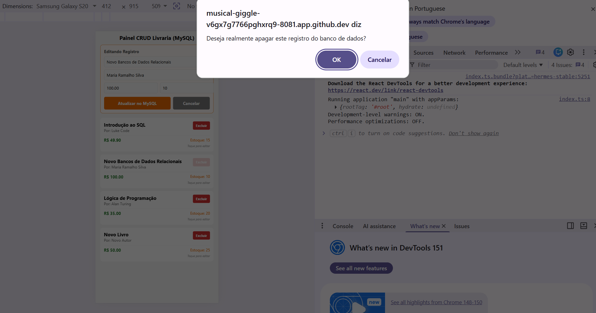
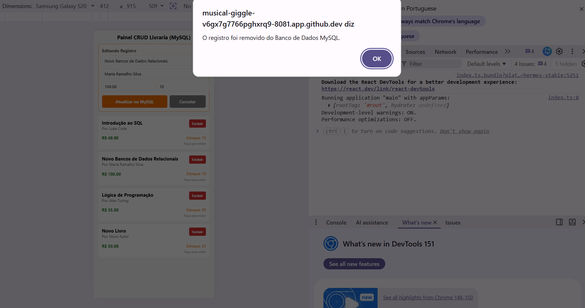
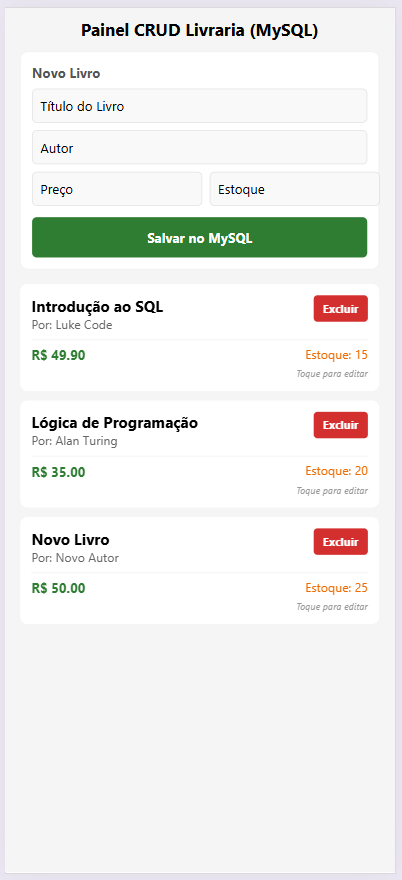

# 03-node-mysql-react-native

# Interação

Dando continuidade à prática anterior: 
https://github.com/wdiasmaciel/02-node-mysql-react-native

Para que o seu app em React Native converse com o MySQL no Codespaces, você precisará de uma API (um back-end) no meio do caminho e precisará liberar uma porta pública no GitHub Codespaces.

---

# Funcionamento  
```text
[ App React Native ]  
        │  (Requisição HTTP / JSON)
        ▼
[ API Back-end: Node.js ] 
        │  (Conexão SQL Nativa)
        ▼
[ Banco de Dados MySQL ] 
```
---

# O que você precisa fazer para dar certo no Codespaces

Para que o aplicativo de celular (ou o emulador) consiga enxergar o seu back-end que está rodando dentro do Codespaces, siga estes passos:

## 1. Criar uma API simples no Codespaces

Você pode criar um servidor simples em `Node.js` (`Express`), dentro do mesmo repositório do Codespaces. 

Esse código vai se conectar ao `MySQL` localmente (usando `localhost` e a senha `root`) e vai expor rotas como `/clientes` ou `/livros`.

## 2. Tornar a porta da API PÚBLICA no GitHub

Por padrão, o Codespaces bloqueia qualquer acesso externo por segurança. 

Se a sua API estiver rodando na porta `3000`, por exemplo, você precisa liberá-la:

1. No VS Code do navegador, vá na aba `Ports` (Portas), que fica ao lado do Terminal.

2. Procure a linha da porta da sua API (ex: 3000).

3. Clique com o botão direito sobre ela, vá em `Port Visibility` (Visibilidade da Porta) e mude de `Private` para `Public`.

O `GitHub` vai te dar uma URL longa, geralmente terminada em `.app.github.dev`.

## 3. Chamar essa URL no React Native

No código do seu aplicativo React Native, você usará o comando `fetch` ou a biblioteca `axios` apontando para a URL gerada pelo `GitHub`:

```javascript
// Exemplo no React Native:
fetch('https://SUA-URL-PUBLICA.app.github.dev/livros')
  .then(response => response.json())
  .then(data => console.log(data));
```
---

# Atualizar a Lista de Pacotes no Linux

Execute o comando abaixo para identificar atualizações de programas:
   ```bash
   sudo apt update
   ```

O comando `sudo apt update` atualiza a lista de pacotes disponíveis e suas versões nos repositórios configurados no seu sistema Linux.

## Significado de Cada Parte do Comando

`sudo`: executa o comando com permissões de administrador (`root`).

`apt`: é o gerenciador de pacotes usado em distribuições como Ubuntu, Debian e Mint. `APT` significa Advanced Package Tool (Ferramenta de Pacotes Avançada). Ele é o sistema que gerencia todos os programas do computador:
   1. Instala novos programas.
   2. Atualiza os softwares existentes.
   3. Remove aplicativos que você não quer mais.
   4. Resolve dependências, que significa instalar automaticamente outros arquivos e bibliotecas que um programa precisa para funcionar.
Antes do APT, os usuários precisavam baixar e compilar cada programa manualmente, o que era muito complexo. O APT automatizou todo esse processo.

`update`: conecta-se aos servidores oficiais para baixar as informações mais recentes sobre os programas disponíveis: 
   - Não atualiza o sistema: este comando não instala atualizações nos programas que já estão no seu computador.
   - Apenas verifica: ele apenas avisa o seu computador quais novas versões de programas existem.
   
## OBS: Instalar Todas as Atualizações

Execute o comando abaixo para instalar as atualizações que foram encontradas:
   ```bash
   sudo apt upgrade
   ```
**Importante**: para instalar o Node.js, basta eu executar `sudo apt update` e `sudo apt install -y nodejs`.

1. O `update` é obrigatório, porque ele atualiza a lista do sistema. Isso garante que o seu computador encontre o Node.js nos servidores e baixe a versão correta.

2. O `upgrade` serve apenas para atualizar os programas que já estão instalados no seu computador. Rodar esse comando apenas faria você perder tempo esperando todo o seu sistema ser atualizado antes de colocar o Node.js.

---

# Instalar o Node.js

Instale o Node.js com o comando abaixo:
   ```bash
   sudo apt install -y nodejs
   ```

---

# Versão do Node.js
Execute o comando abaixo para verificar a versão do Node.js instalado:
   ```bash
   node -v 
   ```
---

# Node Package Manager (NPM):

Verifique a versão do Node Package Manager (NPM) instalado:
   ```bash
   npm -v
   ```

Caso o Node Package Manager (NPM) não esteja instaldo, execute o comando abaixo:
   ```bash
   npm install -g npm@latest
   ```

---

# Criar um Projeto Usando o Expo 

1. https://expo.dev/ 

2. https://docs.expo.dev/ 

  ```bash
  npm install expo
  ```

  ```bash
  npx create-expo-app@latest --template
  ```

Caso seja apresentada a mensagem abaixo, informe `y`:
   ```text
   Need to install the following packages:
   create-expo-app@4.0.0
   Ok to proceed? (y) 
   ```

Com as setas do teclado, escolha o template `Blank (TypeScript)`.

Informe um nome para o aplicativo. Exemplo: `meu-app`.

Selecione a opção: `Latest (SDK 57) - Recommended for most projects`.

   ```text
   ? Select an Expo SDK version: › - Use arrow-keys. Return to submit.
   ❯   Latest (SDK 57) - Recommended for most projects
       For learning with Expo Go (SDK 54)
       Other SDK version…
   ```

Caso seja apresenta a mensagem abaixo, pressione `Y`.
   ```text
   ? You are creating a project inside of an existing Git repository. Skip initializing a new git repository? › (Y/n)
   ```

Entre no diretório do aplicativo:
   ```bash
   cd meu-app
   ```

Execute o comando:
   ```bash
   npx expo install react-dom react-native-web react-native-safe-area-context
   ```

Caso seja apresenta a mensagem abaixo, pressione `Y`.
   ```text
   Need to install the following packages:
   expo@57.0.15
   Ok to proceed? (y) 
   ```

Inicie a aplicação:
   ```bash
   npx expo start
   ```

Caso seja apresentada a mensagem abaixo, informe `y`:
   ```text
   Need to install the following packages:
   expo@57.0.15
   Ok to proceed? (y)
   ```

No teclado, pressione a tecla `w`. A tela do aplicativo será aberta numa nova aba do navegador. 

Abra uma nova aba de terminal no seu Codespaces (clicando no botão `+` no canto superior direito do terminal). Execute o comando:

   ```bash
   git add . && git commit -m "Exemplo: Node, MySQL e React Native" && git push
   ```

---

# Estrutura

Crie a seguinte estrutura de diretórios e arquivos:
   ```text
   ├── api/
   │   ├── excluirLivro.ts           (OPERAÇÃO DELETE (DELETE): remoção física de registro baseada no ID)
   │   ├── lerLivros.ts              (OPERAÇÃO READ (GET): busca em lote todos os livros salvos no MySQL)
   │   └── salvarLivro.ts            (OPERAÇÃO CREATE (POST) & UPDATE (PUT): gravação e modificação de tuplas)
   ├── components/                   
   │   ├── FormularioLivro.tsx       (Responsável por adicionar/editar - POST e PUT)
   │   ├── ItemLivro.tsx             (Responsável por exibir cada livro e excluir - GET e DELETE)
   │   └── Principal.tsx             (Orquestrador: reune todos os componentes)
   ├── interface/                     
   │   ├── InterfaceLivro.ts         (Contrato que diz quais são os campos de um livro vindo do MySQL)
   │   ├── PropriedadesFormulario.ts (Contrato que diz quais são as propriedades de um formulário para livro)
   │   └── PropriedadesLivro.ts      (Contrato que diz quais são as propriedades de um livro)
   └── App.tsx                       (Arquivo principal)
   ```

--- 

# Código do aplicativo

Os arquivos abaixo devem ser criados dentro da pasta `meu-app/`.

## InterfaceLivro.ts

Contrato dos dados recebidos e enviados pela API:

```typescript
export interface InterfaceLivro {
   id: number | undefined;
   titulo: string;
   autor: string;
   preco: number;
   estoque: number;
}
```

## PropriedadesFormulario.ts

Contrato das propriedades usadas pelo formulário:

```typescript
import { InterfaceLivro } from '../interface/InterfaceLivro';

export interface PropriedadesFormulario {
   titulo: string;
   setTitulo: (texto: string) => void;
   autor: string;
   setAutor: (texto: string) => void;
   preco: string;
   setPreco: (texto: string) => void;
   estoque: string;
   setEstoque: (texto: string) => void;
   idEdicao: number | undefined;
   salvarDados: (idEdicao: number | undefined, livro: InterfaceLivro) => void;
   limparFormulario: () => void;
}
```

## PropriedadesLivro.ts

Contrato das propriedades de cada item renderizado na lista:

```typescript
import { InterfaceLivro } from '../interface/InterfaceLivro';

export interface PropriedadesLivro {
   item: InterfaceLivro;
   iniciarEdicao: (livro: InterfaceLivro) => void;
   excluirLivro: (id: number | undefined) => void;
}
```

## lerLivros.ts

Função que executa a operação `GET`:

```typescript
import { InterfaceLivro } from '../interface/InterfaceLivro';

export async function lerLivros(URL_DA_API: string) {
   let livros: InterfaceLivro[] = [];

   await fetch(URL_DA_API)
      .then((resposta) => resposta.json())
      .then((dados: InterfaceLivro[]) => {
         livros = dados;
      })
      .catch((erro) => console.error('Erro ao buscar livros no banco de dados:', erro));

   return livros;
}
```

## salvarLivro.ts

Função que executa as operações `POST` e `PUT`. O verbo e a rota mudam de acordo com a existência do ID:

```typescript
import { Alert } from 'react-native';
import { InterfaceLivro } from '../interface/InterfaceLivro';

export async function salvarLivro(
   idEdicao: number | undefined,
   livro: InterfaceLivro,
   URL_DA_API: string
) {
   const { titulo, autor, preco, estoque } = livro;

   if (!titulo || !autor || !preco || !estoque) {
      Alert.alert('Erro', 'Por favor, realize o preenchimento de todos os campos!');
      return;
   }

   const dadosLivro = {
      titulo: titulo.trim(),
      autor: autor.trim(),
      preco,
      estoque
   };

   const urlFinal = idEdicao === undefined
      ? URL_DA_API
      : `${URL_DA_API}/${idEdicao}`;
   const metodoHttp = idEdicao === undefined ? 'POST' : 'PUT';

   await fetch(urlFinal, {
      method: metodoHttp,
      headers: { 'Content-Type': 'application/json' },
      body: JSON.stringify(dadosLivro)
   })
      .then((resposta) => resposta.json())
      .then(() => {
         Alert.alert(
            'Sucesso!',
            idEdicao === undefined
               ? 'Livro cadastrado no MySQL!'
               : 'Livro atualizado no MySQL!'
         );
      })
      .catch((erro) => console.error('Erro ao processar requisição no servidor:', erro));
}
```

## excluirLivro.ts

Função que solicita confirmação e executa a operação `DELETE`. A confirmação usa o alerta nativo no celular e `window.confirm` na versão web:

```typescript
import { Alert, Platform } from 'react-native';

export async function excluirLivro(id: number, URL_DA_API: string): Promise<boolean> {
   const mensagem = 'Deseja realmente apagar este registro do banco de dados?';

   if (Platform.OS === 'web') {
      if (!window.confirm(mensagem)) {
         return false;
      }
   } else {
      const confirmado = await new Promise<boolean>((resolve) => {
         Alert.alert('Confirmar Exclusão', mensagem, [
            { text: 'Cancelar', style: 'cancel', onPress: () => resolve(false) },
            { text: 'Excluir', style: 'destructive', onPress: () => resolve(true) }
         ]);
      });

      if (!confirmado) {
         return false;
      }
   }

   try {
      const resposta = await fetch(`${URL_DA_API}/${id}`, { method: 'DELETE' });

      if (!resposta.ok) {
         throw new Error(`Erro HTTP ${resposta.status}`);
      }

      const mensagemSucesso = 'O registro foi removido do Banco de Dados MySQL.';
      Platform.OS === 'web'
         ? window.alert(mensagemSucesso)
         : Alert.alert('Removido!', mensagemSucesso);
      return true;
   } catch {
      const mensagemErro = 'Ocorreu um erro ao excluir o registro.';
      Platform.OS === 'web'
         ? window.alert(mensagemErro)
         : Alert.alert('Erro', mensagemErro);
      return false;
   }
}
```

## FormularioLivro.tsx

O formulário usa `flex: 1` nos campos numéricos e nas ações para dividir o espaço disponível, sem depender de largura fixa:

```tsx
import { StyleSheet, Text, View, TextInput, TouchableOpacity } from 'react-native';
import { PropriedadesFormulario } from '../interface/PropriedadesFormulario';
import { InterfaceLivro } from '../interface/InterfaceLivro';

export default function FormularioLivro(props: PropriedadesFormulario) {
   return (
      <View style={[estilos.formulario, props.idEdicao !== undefined && estilos.formularioEdicao]}>
         <Text style={estilos.formularioTitulo}>
            {props.idEdicao !== undefined ? 'Editando Registro' : 'Novo Livro'}
         </Text>

         <TextInput
            style={estilos.entradaTexto}
            placeholder="Título do Livro"
            value={props.titulo}
            onChangeText={props.setTitulo}
         />
         <TextInput
            style={estilos.entradaTexto}
            placeholder="Autor"
            value={props.autor}
            onChangeText={props.setAutor}
         />

         <View style={estilos.fileiraCampos}>
            <TextInput
                    style={[estilos.entradaTexto, { flex: 1, marginRight: 8 }]}
               placeholder="Preço"
               keyboardType="numeric"
               value={props.preco}
               onChangeText={props.setPreco}
            />
            <TextInput
                    style={[estilos.entradaTexto, { flex: 1 }]}
               placeholder="Estoque"
               keyboardType="numeric"
               value={props.estoque}
               onChangeText={props.setEstoque}
            />
         </View>

         <View style={estilos.fileiraAcoes}>
            <TouchableOpacity
               style={[estilos.botao, props.idEdicao !== undefined
                  ? estilos.botaoLaranja
                  : estilos.botaoVerde]}
               onPress={() => {
                  const livro: InterfaceLivro = {
                     id: props.idEdicao,
                     titulo: props.titulo,
                     autor: props.autor,
                     preco: parseFloat(props.preco) || 0,
                     estoque: parseFloat(props.estoque) || 0
                  };
                  props.salvarDados(props.idEdicao, livro);
               }}
            >
               <Text style={estilos.botaoTexto}>
                  {props.idEdicao !== undefined ? 'Atualizar no MySQL' : 'Salvar no MySQL'}
               </Text>
            </TouchableOpacity>

            {props.idEdicao !== undefined && (
               <TouchableOpacity style={estilos.botaoCancelar} onPress={props.limparFormulario}>
                  <Text style={estilos.cancelarTexto}>Cancelar</Text>
               </TouchableOpacity>
            )}
         </View>
      </View>
   );
}

const estilos = StyleSheet.create({
   formulario: { backgroundColor: '#fff', padding: 12, borderRadius: 8, marginBottom: 15, elevation: 2, borderWidth: 1, borderColor: '#eee' },
   formularioEdicao: { borderColor: '#ed6c02', backgroundColor: '#fffbf7' },
   formularioTitulo: { fontSize: 14, fontWeight: 'bold', color: '#555', marginBottom: 8 },
   entradaTexto: { backgroundColor: '#f9f9f9', borderWidth: 1, borderColor: '#ddd', padding: 8, borderRadius: 5, marginBottom: 8 },
   fileiraCampos: { flexDirection: 'row' },
   fileiraAcoes: { flexDirection: 'row', marginTop: 4 },
   botao: { flex: 2, padding: 12, borderRadius: 5, alignItems: 'center' },
   botaoVerde: { backgroundColor: '#2e7d32' },
   botaoLaranja: { backgroundColor: '#ed6c02' },
   botaoCancelar: { flex: 1, backgroundColor: '#777', padding: 12, borderRadius: 5, alignItems: 'center', marginLeft: 8 },
   botaoTexto: { color: '#fff', fontWeight: 'bold' },
   cancelarTexto: { color: '#fff', fontWeight: 'bold' }
});
```

## ItemLivro.tsx

O detalhe do livro usa `minWidth: 0` e `flexShrink: 1`, permitindo que títulos longos ocupem várias linhas sem ultrapassar a tela:

```tsx
import { StyleSheet, Text, View, TouchableOpacity } from 'react-native';
import { PropriedadesLivro } from '../interface/PropriedadesLivro';

export default function ItemLivro(props: PropriedadesLivro) {
   return (
      <TouchableOpacity
         style={estilos.cartao}
         onPress={() => props.iniciarEdicao(props.item)}
         activeOpacity={0.7}
      >
         <View style={estilos.cabecalhoCartao}>
            <View style={estilos.detalhesLivro}>
               <Text style={estilos.livroTitulo}>{props.item.titulo}</Text>
               <Text style={estilos.livroAutor}>Por: {props.item.autor}</Text>
            </View>
            <TouchableOpacity
               style={estilos.botaoDeletar}
               onPress={() => props.excluirLivro(props.item.id)}
            >
               <Text style={estilos.botaoDeletarTexto}>Excluir</Text>
            </TouchableOpacity>
         </View>

         <View style={estilos.fileiraInfo}>
            <Text style={estilos.livroPreco}>R$ {Number(props.item.preco).toFixed(2)}</Text>
            <Text style={estilos.livroEstoque}>Estoque: {props.item.estoque}</Text>
         </View>
         <Text style={estilos.dicaEdicao}>Toque para editar</Text>
      </TouchableOpacity>
   );
}

const estilos = StyleSheet.create({
   cartao: { backgroundColor: '#fff', padding: 12, borderRadius: 8, marginBottom: 10, elevation: 1 },
   cabecalhoCartao: { flexDirection: 'row', alignItems: 'flex-start' },
   detalhesLivro: { flex: 1, minWidth: 0, marginRight: 8 },
   livroTitulo: { fontSize: 16, fontWeight: 'bold', flexShrink: 1 },
   livroAutor: { fontSize: 13, color: '#666' },
   botaoDeletar: { backgroundColor: '#d32f2f', paddingHorizontal: 10, paddingVertical: 6, borderRadius: 4 },
   botaoDeletarTexto: { color: '#fff', fontSize: 12, fontWeight: 'bold' },
   fileiraInfo: { flexDirection: 'row', justifyContent: 'space-between', marginTop: 8, borderTopWidth: 1, borderTopColor: '#eee', paddingTop: 6 },
   livroPreco: { fontSize: 14, fontWeight: 'bold', color: '#2e7d32' },
   livroEstoque: { fontSize: 13, color: '#ed6c02' },
   dicaEdicao: { fontSize: 10, color: '#999', textAlign: 'right', marginTop: 4, fontStyle: 'italic' }
});
```

## Principal.tsx

O componente principal usa `SafeAreaView` para respeitar as áreas seguras do dispositivo, `KeyboardAvoidingView` para o teclado virtual e `FlatList` para permitir a rolagem dos livros:

```tsx
import { useEffect, useState } from 'react';
import { SafeAreaProvider, SafeAreaView } from 'react-native-safe-area-context';
import { StyleSheet, Text, FlatList, ActivityIndicator, KeyboardAvoidingView, Platform } from 'react-native';
import { InterfaceLivro } from '../interface/InterfaceLivro';
import FormularioLivro from './FormularioLivro';
import ItemLivro from './ItemLivro';
import { lerLivros } from '../api/lerLivros';
import { salvarLivro } from '../api/salvarLivro';
import { excluirLivro } from '../api/excluirLivro';

const URL: string = 'https://SUA-URL-PUBLICA.app.github.dev/';
const URL_DA_API: string = URL + 'livros';

export default function Principal() {
   const [livros, setLivros] = useState<InterfaceLivro[]>([]);
   const [carregando, setCarregando] = useState<boolean>(true);
   const [titulo, setTitulo] = useState<string>('');
   const [autor, setAutor] = useState<string>('');
   const [preco, setPreco] = useState<string>('');
   const [estoque, setEstoque] = useState<string>('');
   const [idEdicao, setIdEdicao] = useState<number | undefined>(undefined);

   const carregar = () => {
      lerLivros(URL_DA_API).then((dados) => {
         setLivros(dados);
         setCarregando(false);
      });
   };

   const limparFormulario = () => {
      setIdEdicao(undefined);
      setTitulo('');
      setAutor('');
      setPreco('');
      setEstoque('');
   };

   const salvar = async (id: number | undefined, livro: InterfaceLivro) => {
      await salvarLivro(id, livro, URL_DA_API);
      limparFormulario();
      carregar();
   };

   const excluir = async (id: number) => {
      const removido = await excluirLivro(id, URL_DA_API);
      if (removido) {
         if (idEdicao === id) {
            limparFormulario();
         }
         carregar();
      }
   };

   const iniciarEdicao = (livro: InterfaceLivro) => {
      setIdEdicao(livro.id);
      setTitulo(livro.titulo);
      setAutor(livro.autor);
      setPreco(livro.preco.toString());
      setEstoque(livro.estoque.toString());
   };

   useEffect(() => {
      carregar();
   }, []);

   return (
      <SafeAreaProvider>
         <KeyboardAvoidingView
            style={estilos.teclado}
            behavior={Platform.OS === 'ios' ? 'padding' : undefined}
         >
            <SafeAreaView style={estilos.container}>
               <Text style={estilos.titulo}>Painel CRUD Livraria (MySQL)</Text>
               <FormularioLivro
                  titulo={titulo} setTitulo={setTitulo}
                  autor={autor} setAutor={setAutor}
                  preco={preco} setPreco={setPreco}
                  estoque={estoque} setEstoque={setEstoque}
                  idEdicao={idEdicao}
                  salvarDados={salvar}
                  limparFormulario={limparFormulario}
               />

               {carregando ? (
                  <ActivityIndicator size="large" color="#0000ff" />
               ) : (
                  <FlatList
                     style={estilos.lista}
                     contentContainerStyle={estilos.conteudoLista}
                     data={livros}
                     keyExtractor={(item) => item.id?.toString() || Math.random().toString()}
                     renderItem={({ item }) => (
                        <ItemLivro
                           item={item}
                           iniciarEdicao={iniciarEdicao}
                           excluirLivro={(id) => {
                              if (id !== undefined) {
                                 excluir(id);
                              }
                           }}
                        />
                     )}
                  />
               )}
            </SafeAreaView>
         </KeyboardAvoidingView>
      </SafeAreaProvider>
   );
}

const estilos = StyleSheet.create({
   teclado: { flex: 1 },
   container: { flex: 1, width: '100%', backgroundColor: '#f5f5f5', paddingHorizontal: 16, paddingTop: 10 },
   lista: { flex: 1, width: '100%' },
   conteudoLista: { paddingBottom: 24 },
   titulo: { fontSize: 18, fontWeight: 'bold', textAlign: 'center', marginBottom: 12 }
});
```

## App.tsx

O contêiner da aplicação ocupa toda a tela e não força alinhamento horizontal, permitindo que o componente principal use a largura disponível:

```tsx
import { StatusBar } from 'expo-status-bar';
import { StyleSheet, View } from 'react-native';
import Principal from './components/Principal';

export default function App() {
   return (
      <View style={estilos.container}>
         <Principal />
         <StatusBar style="auto" />
      </View>
   );
}

const estilos = StyleSheet.create({
   container: {
      flex: 1,
      backgroundColor: '#fff'
   }
});
```

### Boas práticas para telas pequenas

- Prefira `flex: 1`, `width: '100%'` e espaçamentos internos a larguras fixas.
- Use `FlatList` ou `ScrollView` quando o conteúdo puder ultrapassar a altura da tela.
- Use `KeyboardAvoidingView` para manter o formulário acessível enquanto o teclado está aberto.
- Em linhas horizontais, use `flexShrink: 1` e `minWidth: 0` para textos longos.
- Teste o aplicativo no celular e na web com diferentes larguras de tela.


# Telas

| Tela Inicial | Tela de Cadastro | Tela de Cadastro |
| :---: | :---: | :---: |
|  |  |  |


| Tela de Atualização | Tela de Atualização | Tela de Atualização |
| :---: | :---: | :---: |
|  |  |  |


| Tela de Exclusão | Tela de Exclusão | Tela de Exclusão |
| :---: | :---: | :---: |
|  |  |  |

---

# Exercício

1. A partir do exemplo desta prática, altere o código, incluindo as telas para as tabelas cliente e pedido.

2. Crie o aplicativo para todas as tabelas da loja que vende equipamento de informática. O banco de dados deve ter as tabelas: cliente, produto e pedido.

3. Crie o aplicativo para todas as tabelas do site de viagens. O banco de dados deve ter as tabelas: cliente, destino turístico e pacote de viagem.

4. Crie o aplicativo para todas as tabelas do sistema de controle de estoque de produtos nas filiais de uma empresa. As entidades do banco de dados devem ser: 

- Fornecedor.
- Produto.
- Identificação.
- Filial.
- Estoque. 

A entidade Fornecedor deve possuir os atributos: id (chave primária), nome, telefone e endereço. 

A entidade Produto deve possuir os atributos: id (chave primária), id_fornecedor (chave estrangeira que se refere à chave primária de fornecedor) e nome. 

A entidade Identificação deve possuir os atributos: id (chave primária), descrição, e observação. 

A entidade Filial deve possuir os atributos: cnpj (chave primária), nome, telefone e endereço. 

A entidade Estoque deve possuir os atributos: id_produto (chave primária e chave estrangeira que se refere à chave primária de Produto), cnpj_filial (chave primária e chave estrangeira que se refere à chave primária de Filial), preço, quantidade e validade (que é a data de validade do produto em estoque. 

No projeto, cada Fornecedor fornece vários produtos, mas cada produto é fornecido por apenas um fornecedor. Cada produto possui apenas uma única identificação e cada identificação refere-se a apenas um único produto. Cada Filial vende vários produtos e cada produto pode ser vendido em mais de uma filial. Por isso, entre as entidades Produto e Filial há a entidade-relacionamento Estoque.
